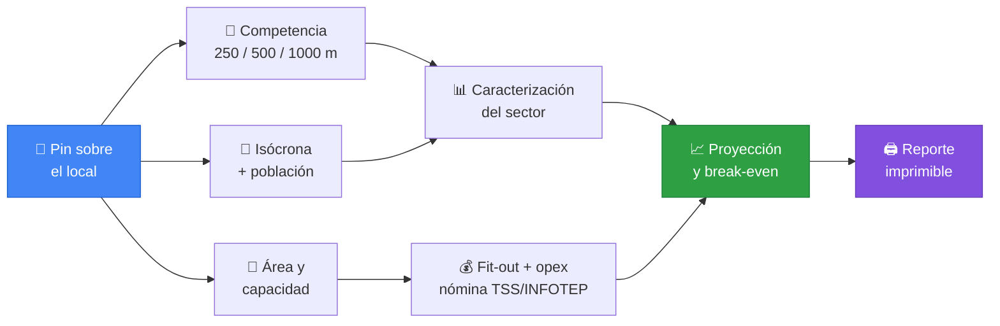
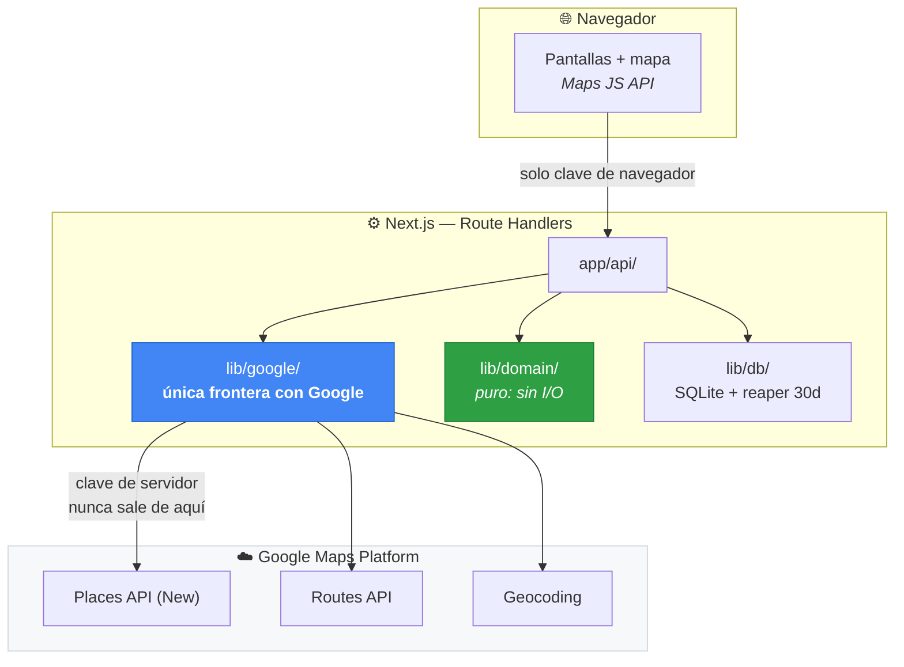
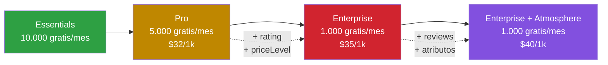
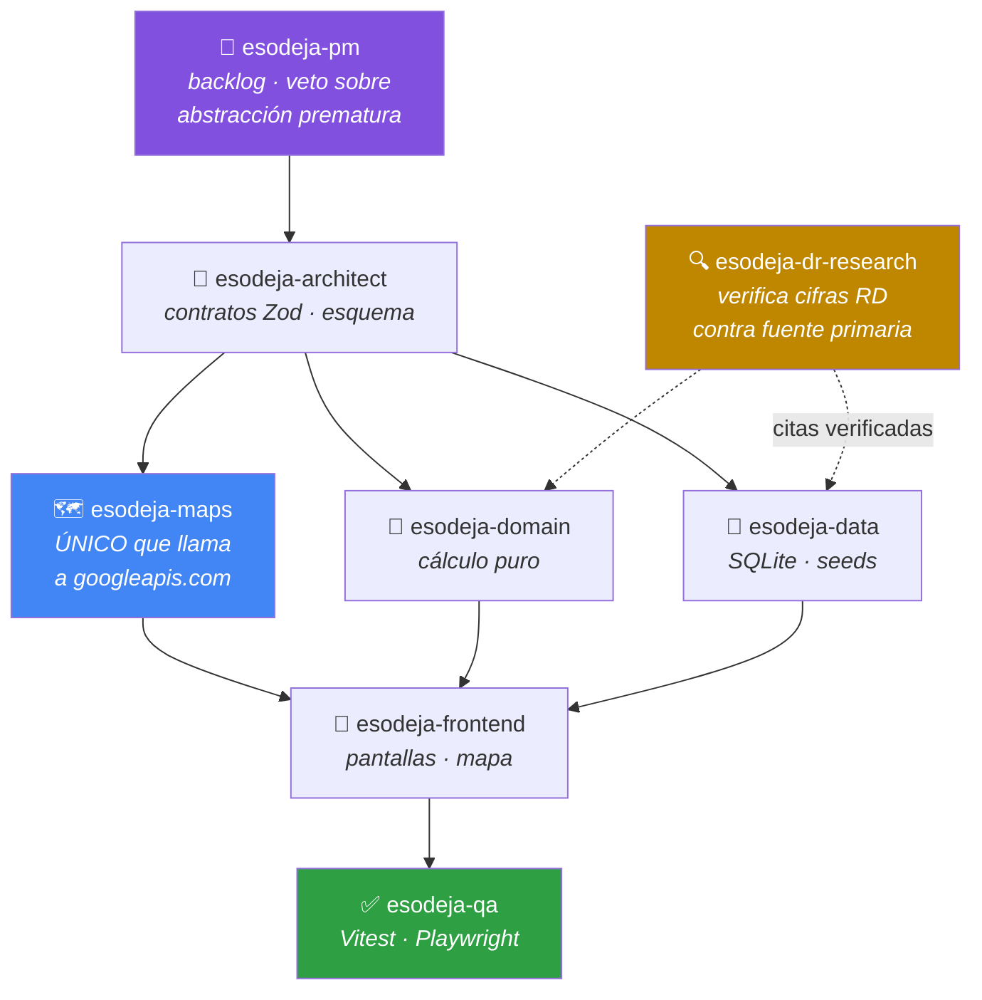

<div align="center">

# Esodeja

**Estudios de mercado geográficos para República Dominicana**

Pon un pin sobre un local en Santo Domingo o Santiago.
Obtén competencia georreferenciada, población alcanzable, costos, proyección financiera y break-even.
Todo como rangos editables, con la procedencia de cada número a la vista.

[](https://nextjs.org)
[](https://www.typescriptlang.org)
[-4285F4?logo=googlemaps&logoColor=white)](https://mapsplatform.google.com)
[](https://github.com/WiseLibs/better-sqlite3)
[](#verificación)
[](#estado-del-proyecto)

</div>

---

## El problema

Decidir dónde abrir un negocio en República Dominicana se hace hoy a ojo. No hay
una herramienta que junte, sobre un mapa, las cuatro cosas que determinan si el
local funciona: **quién compite**, **cuánta gente llega**, **cuánto cuesta
montarlo y operarlo**, y **cuándo se recupera la inversión**.

Esodeja hace eso en un solo recorrido, y — esto es lo que lo distingue — **dice
de dónde sale cada número y cuánta confianza merece**.



---

## Qué mide, y qué no

La distinción no es cosmética: es la diferencia entre una herramienta de
análisis y un generador de cifras bonitas.

| ✅ Lo que sí mide | ❌ Lo que no mide |
|---|---|
| Cuántos negocios del tipo hay, por radio | Facturación de los competidores |
| Cómo se reparten en el espacio | Tráfico peatonal *(no existe para RD)* |
| **Qué proporción figura como cerrada** | Cuota de mercado |
| Qué servicios ofrecen (30+ atributos) | Satisfacción o percepción de clientes |
| Distribución de rating y de precio en DOP | Demografía de la clientela |
| Población alcanzable a pie o en coche | Sentimiento cuantificado de reseñas |

> **Sobre el sentimiento de reseñas.** Google entrega un **máximo de 5 reseñas
> por local**, elegidas por un criterio de relevancia no documentado. Con n=5 el
> intervalo de confianza al 95% es de **±44 puntos porcentuales**: un local "70%
> positivo" es estadísticamente indistinguible de uno "30% positivo". Esodeja
> **no calcula porcentajes de sentimiento**. Muestra el `reviewSummary` que
> produce Google en español, y las reseñas como texto citado. Ver
> [D-11](docs/DECISIONS.md).

---

## Arquitectura

Una sola app Next.js. Un `package.json`. SQLite en fichero. **`npm run dev`
arranca todo** — no hay demonio, ni Docker, ni base de datos que levantar.



| Capa | Elección | Por qué |
|---|---|---|
| App | Next.js 15 App Router + TypeScript | Una sola app, no un monorepo |
| Backend | Route Handlers | Sin NestJS, sin inyección de dependencias |
| Datos | SQLite (`better-sqlite3`) | Sin Postgres, sin PostGIS, sin Docker |
| Geometría | Turf.js en JS | A escala de ciudad y un usuario, sobra |
| Mapa | Google Maps JavaScript API | Vector, Advanced Markers, Drawing |
| Validación | Zod, contratos compartidos | Un solo esquema para cliente y servidor |
| Tests | Vitest + Playwright | Ningún test toca la red |
| PDF | `window.print()` + `@media print` | Cero infraestructura |

---

## Las cuatro reglas que no se rompen

### 1️⃣ Dos claves, y no se confunden

| Variable | Ámbito | Restricción |
|---|---|---|
| `NEXT_PUBLIC_GOOGLE_MAPS_JS_KEY` | Navegador. Solo Maps JS | Referrer HTTP |
| `GOOGLE_MAPS_SERVER_KEY` | **Solo servidor** | Por API, sin referrer |

El navegador **nunca** llama a Places, Routes ni Geocoding. Siempre a través de
un Route Handler propio.

### 2️⃣ Los field masks deciden la factura

Son **cuatro tiers**, no tres. Un solo campo de más no encarece marginalmente:
**cambia el SKU entero** y con él el umbral gratuito.



Las máscaras son **constantes** en [`lib/google/fieldMasks.ts`](lib/google/fieldMasks.ts).
Nunca inline, nunca concatenadas. Hay tests que fallan si una máscara excede su
tier, o si pide campos que en RD facturan y devuelven `null`.

### 3️⃣ Los ToS de Google definen el esquema de datos

Restricción legal, no estética.

| Dato | Permiso |
|---|---|
| `place_id` | ✅ Indefinido |
| Coordenadas | ⚠️ **Máximo 30 días** + reaper |
| Nombre, rating, reseñas, precio, horarios | ❌ **Jamás tocan la base de datos** |
| Métricas agregadas propias | ✅ Sí — son análisis nuestro |

> Un estudio archivado conserva sus conclusiones y sus agregados, pero **no puede
> volver a mostrar la lista nominal de competidores** sin re-consultar. Es
> correcto y es como debe ser.

### 4️⃣ Rangos, nunca puntos

```diff
- Inversión inicial: RD$2.847.300
- Break-even: mes 14

+ Inversión inicial: RD$2,1M – 2,8M – 3,6M   · estimado
+   ← costo/m² (referencia sectorial, ICDV 2026-Q2) × área (usuario)
+
+ Break-even: mes 11 – 14 – 22               · estimado
+   ← sensible a ticket promedio y tasa de ocupación
```

La segunda forma es más larga y menos satisfactoria de mirar. También es la
única de las dos que es cierta.

Todo dinero es `Money = {amount, currency}` — nunca un `number`. Sumar monedas
distintas **lanza**. **Nunca hay conversión FX implícita**: la tasa es un input
explícito y editable.

---

## Coste real por estudio

| Fase | SKU | Unidades | USD |
|---|---|---|---|
| Censo de competencia | Nearby Search Enterprise | 6 llamadas | $0,210 |
| Caracterización | Nearby Search Ent. + Atmosphere | 2 llamadas | $0,080 |
| Isócrona | **Isochrones API** *(Preview)* | 2 llamadas | **$0,000** |
| Contexto | Geocoding + Dynamic Maps | 2 | $0,012 |
| | | **Total** | **≈ $0,30** |

**Coste marginal real: $0,00.** Los umbrales gratuitos son por SKU, y el cuello
de botella (censo Enterprise, 6 llamadas/estudio contra 1.000 gratis/mes)
permite **166 estudios al mes sin factura**. Muy por encima de lo que un solo
usuario necesita.

> ℹ️ **La isócrona usa la Isochrones API**, que devuelve un polígono real
> consciente de la red viaria — no una aproximación por sondas radiales. Está en
> **Preview**: gratis hoy, facturable al pasar a GA, y con cobertura por país sin
> declarar. Se verifica contra RD antes de construir encima. Ver
> [D-16](docs/DECISIONS.md).

---

## Los agentes

Ocho agentes en [`.claude/agents/`](.claude/agents/) con **fronteras disjuntas**.
No son plantillas genéricas: cada uno lleva escrito el fallo concreto del
proyecto anterior que le toca prevenir.



| Agente | Frontera | Su misión distintiva |
|---|---|---|
| `esodeja-pm` | `docs/BACKLOG.md`, `docs/DECISIONS.md` | **Veto** sobre abstracciones sin dos implementaciones reales |
| `esodeja-architect` | `lib/schemas/**`, `docs/adr/**` | Único que define contratos |
| `esodeja-maps` | `lib/google/**`, `app/api/google/**` | **Único** autorizado a llamar a Google |
| `esodeja-domain` | `lib/domain/**` | Puro: sin I/O, sin red, sin DB |
| `esodeja-frontend` | `app/**`, `components/**` | Nunca llama a Google directamente |
| `esodeja-data` | `lib/db/**`, `data/**` | Reaper de retención de 30 días |
| `esodeja-qa` | `**/*.test.ts`, `e2e/**` | Ningún test toca la red |
| `esodeja-dr-research` | `docs/sources/**` | Fuente primaria o "no verificado" |

Cuatro skills en [`.claude/skills/`](.claude/skills/) con los precios, las citas
legales y las trampas conocidas: `google-maps-platform`, `dr-market-data`,
`ranges-and-provenance`, `esodeja-testing`.

---

## Puesta en marcha

```bash
git clone https://github.com/FCornielle/Sodeja.git esodeja
cd esodeja
npm install
cp .env.local.example .env.local   # y rellena las dos claves
npm run dev                        # → http://localhost:3000
```

La portada reporta el estado de configuración sin exponer ningún secreto.

<details>
<summary><b>APIs a habilitar en Google Cloud</b></summary>

| API | Para qué |
|---|---|
| Maps JavaScript | El mapa, la selección y el dibujo del polígono |
| Places API (New) | Competencia, caracterización, búsqueda |
| Routes API | Isócronas aproximadas |
| Geocoding | Dirección ↔ coordenada |
| Maps Static | Mapa embebido en el reporte |
| Street View Static | Fachada en el reporte |

Y **dos claves separadas**: la de navegador restringida por referrer y solo a
Maps JS; la de servidor sin referrer y limitada al resto.

</details>

<details>
<summary><b>Estructura del proyecto</b></summary>

```
app/            Pantallas (Server Components) + Route Handlers en app/api/
components/     UI
lib/google/     Todo lo que llama a googleapis.com — frontera de esodeja-maps
lib/domain/     Motor de cálculo. PURO: sin I/O, sin red, sin DB
lib/db/         SQLite, migraciones, reaper de retención
lib/schemas/    Contratos Zod
data/           Base SQLite, seeds, censo y geometría
docs/           BACKLOG.md, DECISIONS.md, adr/, sources/
e2e/            Playwright + fixtures de Google
```

</details>

---

## Verificación

```bash
npm test           # Vitest — 45 tests. Ningún test toca la red
npm run test:e2e   # Playwright con Google mockeado
npm run typecheck
npm run lint
```

Tres tests son **guardarraíles**: no verifican una funcionalidad, protegen una
restricción del proyecto.

| Guardarraíl | Qué protege |
|---|---|
| **Field masks** | La factura. Falla si una máscara excede su tier declarado |
| **Esquema SQLite** | Lo legal. Falla si una columna persiste contenido de Places |
| **Golden file** | La reproducibilidad. Mismo input + misma versión = mismo output |

---

## Estado del proyecto

| Sprint | Contenido | Estado |
|---|---|---|
| **0** | Scaffold, 8 agentes, 4 skills, field masks | ✅ **hecho** |
| **1** | Mapa, medidor de coste, competencia, proyección mínima | 🔓 bloqueado por E-1 |
| **2** | Seeds dominicanos, nómina TSS/INFOTEP, editor de supuestos | ⏳ pendiente |
| **2B** | Caracterización del sector, `reviewSummary`, tasa de cierre | ⏳ pendiente |
| **3** | Isócronas, población censal, índice de demanda | ⏳ pendiente |
| **4** | Reporte imprimible, historial, E2E completo | ⏳ pendiente |

**Ruta crítica:** `E-0 ✓ → E-1 → E-3 → E-2 → E-20 → E-4 → E-5 → E-6 → E-7`

El backlog completo, con criterios de aceptación verificables y coste declarado
por item, está en [`docs/BACKLOG.md`](docs/BACKLOG.md).

---

## Por qué existe este repositorio

Esodeja reemplaza a **SODEJA**, que acumuló ~19.000 líneas de código de buena
calidad, 406 tests y 26 endpoints funcionales — **y nunca produjo un solo
estudio de mercado**.

No falló por ejecución. Falló por una regla puesta al inicio y nunca revisada:
*"ningún servicio de pago será aprovisionado"*. De ahí salieron cuatro agujeros
simultáneos:

| Agujero | Evidencia |
|---|---|
| El mapa nunca tuvo tiles | El propio código se describía como `UNVERIFIED placeholder` |
| No había datos de competencia | El proveedor de POI lanzaba `NOT_CONFIGURED` siempre |
| Los adaptadores de Google **nunca se ejecutaron** | Código HTTP real, bloqueado tras una variable vacía |
| El peso operativo mataba la iteración | 12 workspaces, Docker, PostGIS obligatorio |

El activo real de ese proyecto no era el software: era la **curación de datos
dominicanos verificados**. Eso se porta. El código se descarta.

> **Regla de oro heredada de ese fracaso:** vertical antes que horizontal. Nada
> se abstrae hasta tener dos implementaciones reales. Ningún sprint cierra sin
> que el recorrido completo funcione de punta a punta.

El historial completo de SODEJA queda preservado en el tag
[`archive/sodeja-v1`](https://github.com/FCornielle/Sodeja/tree/archive/sodeja-v1).

---

## Aviso

Esodeja es una **herramienta de análisis, no un dictamen**. Las observaciones
legales y fiscales son planificación de riesgo, no asesoría. Cualquier
conclusión con consecuencia legal, fiscal o contable requiere revisión de un
profesional dominicano habilitado.

Los datos de población proceden del **Censo ONE 2022**, que registra un **20,6%
de omisión de hogares** — la peor en 20 años, sesgada hacia Santiago y Santo
Domingo. Esa advertencia se muestra junto al número, no en un pie de página.

Contenido de Google Maps Platform mostrado bajo sus
[Términos de Servicio](https://cloud.google.com/maps-platform/terms/).

<div align="center">
<sub>Proyecto de un solo usuario · República Dominicana · 2026</sub>
</div>
